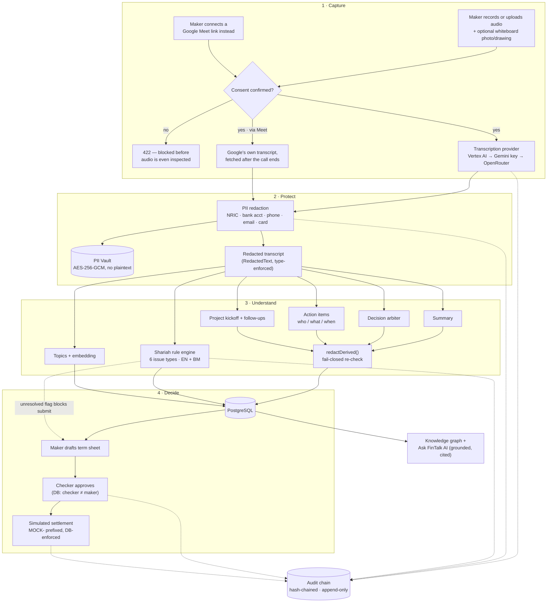

<div align="center">


# FinTalk AI

**Every credit decision, captured and auditable.**

AI-assisted meeting intelligence for Malaysian credit committees — records the conversation, redacts personal data before it's ever stored, screens it against seven Shariah-compliance rules, and keeps a tamper-evident audit trail from first upload to final settlement.

[](frontend/package.json)
[](frontend/package.json)
[](backend/package.json)
[](backend/package.json)
[](backend/prisma/schema.prisma)
[](backend/prisma/schema.prisma)
[](backend/src/ai/gemini.provider.ts)
[](https://github.com/SkyLee310/FinTalk-AI/actions/workflows/ci.yml)
[](https://fintalk-ai.vercel.app)
[](backend/railway.json)
[](#-license)

</div>

---

## 🚀 Live Demo

**→ [fintalk-ai.vercel.app](https://fintalk-ai.vercel.app)**

The fastest way to evaluate this project is to click a role and watch it sign in — no setup, no test data to imagine:

1. Open the [live app](https://fintalk-ai.vercel.app/login).
2. Click any role below the sign-in form. It **visibly fills the email and password fields, then submits** — the same path a real sign-in takes, not a hidden shortcut.
3. You land on that role's first permitted section automatically — **Review Meetings** for Maker, Checker, Shariah and Oversight; **Administration** for Admin, who deliberately holds no transcript access at all.

| Role | Email | Password | What they can do |
|---|---|---|---|
| **Maker** | `maker@fintalk.ai` | `Demo!2345` | Record/upload meetings, draft term sheets |
| **Checker** | `checker@fintalk.ai` | `Demo!2345` | Approve term sheets, settle facilities (never their own draft) |
| **Shariah** | `shariah@fintalk.ai` | `Demo!2345` | Review and clear/confirm Shariah findings |
| **Oversight** | `oversight@fintalk.ai` | `Demo!2345` | Read-only view across meetings and the audit trail |
| **Admin** | `admin@fintalk.ai` | `Demo!2345` | Approve sign-ups, manage users |

> All five accounts run against **synthetic seed data only**. This is intentional, product-level scaffolding for demos (`frontend/src/app/login/page.tsx`) — not a security oversight.

Worth trying live: record or upload a short clip on **Capture**, then watch **Review** fill in with a transcript, redactions, and Shariah findings within seconds; ask **Ask FinTalk AI** a question like *"what facilities were discussed this month?"* and see it answer with citations instead of guessing.

---

## 🧭 Overview

Credit committee meetings at Malaysian banks — especially Islamic banks — produce the single most sensitive artifact in the lending process: a recorded conversation containing customer identifiers, deal terms, and the exact language that later determines whether a facility is *Shariah*-compliant. Today that artifact is usually a phone recording, a handwritten note, and someone's memory of what was agreed — expensive to redact properly, easy to get wrong on a Shariah technicality, and nearly impossible to audit after the fact.

**FinTalk AI turns that meeting into a governed, auditable record**, end to end:

1. A **maker** records or uploads the meeting (and optionally photographs the whiteboard), after confirming consent and a cross-border data disclosure.
2. Audio goes to Gemini for transcription — a plain API key locally, or Vertex AI's GCP service-account auth in production — **held in memory only, never written to disk.**
3. Before anything touches the database, every identifier (NRIC, bank account, phone, email, card number) is **redacted and sealed into an encrypted vault**; the rest of the system only ever sees placeholders.
4. The redacted transcript is screened by a **deterministic, bilingual Shariah rule engine** (English + Bahasa Rojak) for six issue types — every finding is advisory, and only a human holding the `SHARIAH` role can clear or confirm one.
5. The same redacted text drives **AI meeting intelligence**: the final decision each debated point reached, a who/what/when action list, and an instant project-kickoff draft — each independently re-verified for leaked PII before it's stored.
6. A **maker** drafts a term sheet; a **different person** (enforced at the database level, not just in application code) approves it — and submission is blocked outright while any Shariah finding is unresolved.
7. An approved facility can be **simulated-settled** (explicitly fake, `MOCK-`-prefixed, DB-constrained — no money ever moves) or exported as a CSV handoff.
8. **Every step writes to a hash-chained, append-only audit log** that Postgres triggers refuse to let anyone edit or delete.

This isn't a mockup wrapped around a chatbot — it's redaction-by-construction, segregation of duties enforced by database constraints, and a compliance posture rigorous enough that the repository includes its own [regulatory gap analysis](docs/compliance/2026-08-10-regulatory-compliance-review.md) against five real Malaysian financial-law instruments.

### Enforced, not just documented

Four invariants aren't conventions here — each fails loudly if broken, at the database level as well as in application code:

- **Personal data cannot be stored unredacted.** `RedactedText` is a branded type minted in exactly one module; the persistence layer accepts nothing else, so an unredacted write does not compile — and an architecture test fails the build if any other module tries to mint one.
- **An Islamic facility cannot carry an interest rate.** A Postgres `CHECK` constraint makes the combination unstorable, so the product cannot emit the exact violation it exists to detect.
- **The AI never issues a Shariah ruling.** A finding can only leave `FLAGGED` via a user holding the `SHARIAH` role — enforced in the capability matrix, the service layer, and a database constraint requiring reviewer attribution. An administrator cannot do it either.
- **One person cannot approve their own work.** The checker is never the maker, enforced in the capability matrix, the service, and a `CHECK` constraint — and a term sheet cannot even be submitted while a Shariah finding on its meeting is unresolved.

---

## ✨ Key Features

| | Feature | What makes it real |
|---|---|---|
| 🎙️ | **Multi-modal capture** | Browser recording, file upload, whiteboard photos (auto-converted to a Mermaid diagram), and an in-browser whiteboard you can draw on — all in one meeting record |
| 📅 | **Google Meet import** | Link a Google account, paste a Meet link, and sync that call's transcript into the same redaction → Shariah → audit pipeline. No bot joins the call — it reads the transcript Google itself produced, which means Meet's own Transcripts feature has to be on during the call ([see Limitations](#-limitations)) |
| 🗣️ | **Live captions while recording** | Browser-side speech recognition streams the conversation as you capture it, so a silent progress bar isn't the only feedback |
| 🪄 | **Conversational capture wizard** | Ask FinTalk AI can set up a capture by talking you through it — name, consent, then import-audio or record-live. Only the upload path is automated; consent and pressing record stay human |
| 🔒 | **Fail-closed PII redaction** | NRIC, bank account, phone, email, and Luhn-validated card numbers are stripped before storage; a branded `RedactedText` type makes an unredacted write a compile error, not a policy |
| 🔑 | **Encrypted PII vault** | Every detected identifier is sealed with AES-256-GCM — there is no plaintext column anywhere in the schema |
| ☪️ | **Deterministic Shariah engine** | Seven versioned, bilingual rules across six issue types (riba, gharar, maysir, haram-sector activity, late-payment mischaracterisation, contract mismatch) — regex-based on purpose, so every rule can be shown to a Shariah committee and argued with |
| 🤝 | **Four-eyes approval** | A term sheet's checker can never be its own maker — enforced by a Postgres `CHECK` constraint, not just a UI rule |
| 🧠 | **AI meeting intelligence** | A decision arbiter, a role-attributed action-item extractor (never a name), and an instant project-kickoff draft — every field independently re-verified for PII and discarded (not patched) if it fails |
| 💬 | **Ask FinTalk AI** | A grounded, cited assistant across every meeting — it never opens the PII vault, answers only from retrieved redacted excerpts, and says "not found" rather than guessing. Also available scoped to a single meeting, from that meeting's own page |
| 🕸️ | **Knowledge graph** | Meetings connect by shared topics and embedding similarity, so patterns across deals surface without anyone tagging anything by hand |
| 🔎 | **Universal search** | One search box across meetings, decisions, action items, Shariah findings and graph nodes — capability-filtered, so it never surfaces a row the session couldn't open |
| 🔔 | **Notifications** | A term sheet awaiting approval, a transcript landing with Shariah flags, an approval decision coming back — routed to whoever holds the capability to act on it |
| 📊 | **Inclusivity analyzer** | Deterministic, rule-based talk-share breakdown per speaker — no model call, no PII risk, just arithmetic on segment timestamps |
| 🧾 | **Immutable audit chain** | Every action appends to a hash-chained log; Postgres triggers reject `UPDATE`/`DELETE` outright |
| 💳 | **Simulated settlement** | Explicitly fake by design — `simulated = true` is a database `CHECK` constraint, and every reference is `MOCK-`-prefixed so it can never be mistaken for a real payment |
| 🛡️ | **Resilient AI layer** | A provider interface (`TranscriptionProvider`) with two independent fallback tiers — Vertex AI and the Gemini API key cover for each other automatically, whichever is primary, and an optional OpenRouter tier wraps the pair. Every tier is opt-in by environment variable; unset, boot behaviour is byte-for-byte what it was before |
| 👥 | **Self-service onboarding** | Public sign-up lands an account in `PENDING` with zero capabilities until an admin approves and assigns a role |
| 🎬 | **One-click demo accounts** | Five roles, one click each, for exactly this kind of evaluation |
| 💰 | **No float ever touches money** | Amounts are `BigInt` minor units and rates are integer basis points, both crossing HTTP as strings — a JSON number silently drops cents above 2^53, and `JSON.stringify` can't serialize a `BigInt` at all |

---

## 🏗️ Architecture



**Deployment topology:** Next.js frontend on **Vercel**, Fastify API on **Railway**, both talking to one **Railway Postgres** instance. The frontend never calls the backend's origin directly — `next.config.ts` rewrites `/api/:path*` to it — because the session cookie is `httpOnly` and third-party between `vercel.app` and `railway.app`, which Safari's tracking prevention silently discards. Proxying makes the cookie first-party without giving up `httpOnly`.

Full request-time behavior: [`backend/src/pipeline/process-meeting.ts`](backend/src/pipeline/process-meeting.ts).

---

## 🧰 Tech Stack

| Layer | Technology | Role |
|---|---|---|
| **Frontend** | Next.js 15 (App Router) | UI, routing, SSR/rewrite proxy to the API |
| | React 19 · TypeScript 5.7 | Component model, type safety |
| | Tailwind CSS 4 | Design system — terminal-fintech aesthetic, dark/light theme |
| | Mermaid | Renders AI-extracted whiteboard diagrams |
| | Vitest | Unit tests |
| **Backend** | Fastify 5 | HTTP API, cookie sessions, multipart upload |
| | Prisma 6 + PostgreSQL 16 | ORM, migrations, and hand-written `CHECK` constraints/triggers |
| | Zod | Request validation |
| | Argon2id | Password hashing |
| | `jose` (JWT) | Access/refresh token pair, separate secrets |
| | Vitest | Unit + integration tests (real Postgres in CI) |
| **AI** | Google Gemini (`@google/genai`) | Transcription, summarization, Shariah-safe generation, embeddings — API key locally, Vertex AI service account in production |
| | OpenRouter | Optional outermost fallback tier, wrapping whichever Gemini transport is active |
| | `googleapis` | Google Meet REST API v2 + OAuth 2.0 — post-call transcript import |
| **Infra** | Vercel | Frontend hosting/CI |
| | Railway | Backend + Postgres hosting, migration-gated deploys |
| | GitHub Actions | CI — backend + frontend test suites, plus a dedicated secret-leak scan (`gitleaks`) |

---

## 📁 Project Structure

```
FinTalk-AI/
├── frontend/                    # Next.js App Router
│   ├── src/app/                 #   /login, /record, /meetings, /approvals, /knowledge,
│   │                             #   /islamic-banking, /admin, /audit, /settings
│   ├── src/components/          #   sidebar, top search, notification bell, capture wizard,
│   │                             #   whiteboard canvas, meeting-detail tabs, shared UI kit
│   └── src/lib/                 #   api client, nav (capability-gated), participation, shariah-guidance
│
├── backend/                     # Fastify API
│   ├── src/routes/              #   auth, meetings, whiteboards, knowledge, compliance, users,
│   │                             #   feedback, search, notifications, live-caption, google-auth,
│   │                             #   google-webhook
│   ├── src/pipeline/            #   process-meeting.ts — the capture pipeline
│   │                             #   google-meet-fetcher.ts — Meet transcript import
│   ├── src/ai/                  #   provider interface, gemini (API key or Vertex AI) / openrouter / fallback / fake
│   ├── src/pdpa/                #   PII detectors, redactor, encrypted vault
│   ├── src/shariah/             #   rule engine (6 issue types)
│   ├── src/audit/                #   hash-chained append-only log
│   ├── src/auth/                #   RBAC, capability matrix, tokens, Google OAuth
│   ├── src/knowledge/           #   graph + Ask FinTalk AI assistant + capture-intent detection
│   ├── prisma/schema.prisma     #   21 models, 22 hand-written migrations
│   └── prisma/sql/constraints.sql  # DB-level invariants (four-eyes, rate exclusivity, simulated=true)
│
├── docs/superpowers/specs/        # Original design specification
├── docs/compliance/              # Regulatory gap analysis vs. real MY statutes
├── .github/workflows/ci.yml      # Backend + frontend tests, secret scanning
└── Rubric/                       # Hackathon judging criteria this build targets
```

---

## ⚡ Getting Started

**Prerequisites:** Node.js ≥ 20 · PostgreSQL 16 · npm

### 1. Clone and start Postgres

```bash
git clone https://github.com/SkyLee310/FinTalk-AI.git
cd FinTalk-AI
docker run -d --name fintalk-postgres -e POSTGRES_PASSWORD=postgres -e POSTGRES_DB=fintalk -p 5432:5432 postgres:16
```

### 2. Backend

```bash
cd backend
npm install
cp .env.example .env
```

Minimum to boot with zero API keys: leave `TRANSCRIPTION_PROVIDER=fake`. Generate the three secrets `.env` needs and paste each into it:

```bash
node -e "console.log('JWT_ACCESS_SECRET=' + require('crypto').randomBytes(48).toString('base64'))"
node -e "console.log('JWT_REFRESH_SECRET=' + require('crypto').randomBytes(48).toString('base64'))"
node -e "console.log('PII_VAULT_KEY=' + require('crypto').randomBytes(32).toString('base64'))"
```

`PII_VAULT_KEY` must be exactly 32 bytes base64 — the server refuses to start otherwise, and names the offending variable.

```bash
npm run db:generate
npm run db:deploy        # applies all 22 migrations, non-interactively
npm run db:constraints   # applies the hand-written CHECK constraints/triggers
npm run db:seed          # creates the five demo accounts + sample data
npm run dev               # → http://localhost:8080
```

### 3. Frontend

```bash
cd frontend
npm install
cp .env.example .env.local
# NEXT_PUBLIC_API_BASE_URL=http://localhost:8080 is the default — fine as-is.
npm run dev               # → http://localhost:3000
```

Visit **http://localhost:3000/login** and click any demo role, or sign up and self-approve via the Admin account.

### Running the tests

```bash
cd backend && npm test          # 46 files — unit + integration (needs Postgres)
cd frontend && npm test         # component/unit suite
```

---

## 🚢 Deploying

**Backend → Railway** (root directory `backend`). The dashboard's pre-deploy command must apply migrations before anything else touches the database:

```
npm run db:deploy && npm run db:constraints
```

This is a hard-won lesson, not a suggestion — `backend/railway.json` documents it inline. On 2026-08-10 this service's pre-deploy command ran `npm run db:seed:deploy` instead: seeding, but never migrating. Five consecutive deploys failed with Prisma `P2022`, because the seed script's client knew about columns no migration had touched — the server never started, and Railway kept serving the last good build, so the app *looked* healthy while running stale code. Two rules follow: migrations run before anything else touches the database (`constraints.sql` alters tables the migrations create, so it can't go first), and **seeding must never gate a deploy** — demo data failing to load is not a reason to refuse to serve.

Give the Postgres service a persistent volume at `/var/lib/postgresql/data`. Without one, the database is wiped whenever the container is recreated.

**Frontend → Vercel** (root directory `frontend`). Set `NEXT_PUBLIC_API_BASE_URL` to the Railway backend's URL — see [Architecture](#-architecture) above for why the frontend proxies every API call through it rather than calling it directly.

---

## 🔐 Environment Variables

Never commit a real `.env` — both are gitignored, and CI fails the build if one is ever tracked. Copy the `.env.example` in each folder and fill in your own values.

**`backend/.env`**

| Variable | Purpose |
|---|---|
| `NODE_ENV`, `PORT`, `CORS_ORIGIN` | Server basics |
| `DATABASE_URL` | Postgres connection string (Railway injects this in production) |
| `TRANSCRIPTION_PROVIDER` | `gemini` \| `vertex` \| `fake` — `fake` needs no API key and is what CI runs on |
| `GEMINI_API_KEY`, `GEMINI_MODEL_TRANSCRIBE`, `GEMINI_MODEL_VISION`, `GEMINI_MODEL_TEXT` | Required only when the provider is `gemini` (API-key auth against the Gemini Developer API) |
| `GEMINI_MODEL_EMBEDDING` | Optional, `gemini` mode only — without it nothing fails at boot and nothing goes down: the knowledge graph falls back to topic-overlap connections, and Ask FinTalk AI falls back from semantic to keyword retrieval, labelling which one produced each answer |
| `VERTEX_PROJECT_ID`, `VERTEX_LOCATION`, `GCP_SERVICE_ACCOUNT_KEY`, `VERTEX_MODEL_TRANSCRIBE`, `VERTEX_MODEL_VISION`, `VERTEX_MODEL_TEXT` | Required only when the provider is `vertex` — the same Gemini models, reached through a GCP service account's IAM identity instead of an API key. **This is what production runs.** |
| `VERTEX_MODEL_EMBEDDING` | Optional, `vertex` mode only — same degrade behavior as `GEMINI_MODEL_EMBEDDING`. **Production reads this one**, not the `GEMINI_` variant |
| `OPENROUTER_API_KEY`, `OPENROUTER_MODEL`, `OPENROUTER_MODEL_TRANSCRIBE` | Optional outermost fallback tier, wraps whichever provider is active — leave blank and it behaves exactly as before |
| `AI_REQUEST_TIMEOUT_MS` | How long any single AI call may run before it's abandoned (defaults to 30s) |
| `GOOGLE_CLIENT_ID`, `GOOGLE_CLIENT_SECRET`, `GOOGLE_REDIRECT_URI` | Optional — OAuth credentials for Google Meet transcript import. Unset, the feature reports itself unconfigured instead of erroring |
| `GOOGLE_WEBHOOK_SECRET` | Optional shared secret checked on `POST /webhooks/google-meet`; unset, the endpoint accepts unauthenticated notifications |
| `JWT_ACCESS_SECRET`, `JWT_REFRESH_SECRET`, `JWT_ACCESS_TTL`, `JWT_REFRESH_TTL` | Session tokens — secrets must be ≥ 32 chars (`openssl rand -base64 48`) |
| `PII_VAULT_KEY` | AES-256-GCM key for the PII vault — exactly 32 bytes, base64 (`openssl rand -base64 32`) |
| `MEETING_RETENTION_DAYS` | PDPA retention window (defaults to a placeholder — see [Limitations](#-limitations)) |

**`frontend/.env.local`**

| Variable | Purpose |
|---|---|
| `NEXT_PUBLIC_API_BASE_URL` | Backend origin the Next.js rewrite proxies `/api/*` to. Inlined into the browser bundle — never put a secret behind a `NEXT_PUBLIC_*` name |

---

## 🖱️ Usage

The sidebar is named after the work, not the database tables — five stages, opening on the one you're most likely to want:

1. **Review Meetings** *(Maker/Checker/Shariah/Oversight)* — the default landing section. Read the transcript with redactions inline, low-confidence segments flagged for human confirmation, and any Shariah findings with their excerpt, reference, and confidence. Split across Summary / Transcript / Shariah Compliance / Term Sheet tabs, with a per-meeting AI chat grounded on that meeting alone.
2. **Capture** *(Maker)* — record in-browser with live captions, upload a file, connect a Google Meet link, photograph or draw the whiteboard, confirm consent and the cross-border transfer disclosure.
3. **Decide** *(Maker drafts → Checker approves)* — draft a term sheet as a conventional or Islamic facility (never both), submit for approval, and settle (simulated) once approved. Blocked entirely while a Shariah flag is unresolved.
4. **Knowledge Graph** *(anyone with transcript access)* — ask **Ask FinTalk AI** a question across every meeting, grounded and cited, or browse the graph of how meetings connect.
5. **Administration** *(Admin)* — approve pending sign-ups, assign roles, and read the audit trail (Oversight can be granted this independently of meeting access).

**Islamic Banking**, reachable by every role, is reference material — the same Shariah-principle explanations that back every flag raised in Review, so a finding is never just an opaque badge.

Above the sidebar sit two shell-wide controls: a **search box** spanning meetings, decisions, action items, Shariah findings and graph nodes, and a **notification bell** for work routed to whoever can act on it. **Settings** carries appearance, avatar colour, Google account linking, and feedback.

---

## 📄 Example

Illustrative shape of what the pipeline produces (fields match the real schema in `backend/prisma/schema.prisma`; content below is representative, not a captured transcript):

```jsonc
// Transcript.rawRedacted (excerpt) — identifiers already sealed in the vault
"...the applicant [PERSON_NAME_1], IC [NRIC_1], is requesting financing for
working capital. We quote 8% interest per annum, paid monthly..."

// Resulting ShariahFlag
{
  "issueType": "RIBA",
  "excerpt": "we quote 8% interest per annum",
  "detectedBy": "rule:riba.interest-rate-mention",
  "confidence": 0.93,
  "reference": "BNM Shariah Governance Policy — requires legal confirmation",
  "status": "FLAGGED"
}

// Resulting ActionItem — owner is a role/speaker label, never a name
{ "owner": "Checker", "task": "Confirm profit-rate structure with applicant", "dueDate": "next meeting" }
```

---

## 📈 Performance / Evaluation

No formal accuracy or latency benchmark suite exists yet, and none is claimed here — what's real and checkable today:

- **46 backend test files** (unit + integration) and a **frontend test suite**, covering redaction, the audit chain, RBAC/four-eyes invariants, the Shariah engine, the AI provider fallback path, settlement constraints, Google Meet ingestion, and more.
- **CI runs the full integration suite against a real Postgres 16 service container** on every push — not mocked — so the compliance invariants (checker ≠ maker, simulated settlement, append-only audit) are proven against the real database engine, not just asserted in application code.
- **`processingMs`** is recorded on every transcript (wall-clock time from upload to stored transcript) and shown on the meeting page — no aggregate number is published, but the per-meeting figure is real, not decorative.
- Transcription **confidence scores are self-reported by Gemini, not a calibrated accuracy metric** — the UI is required to label them "model self-reported confidence," never "accuracy," and segments below `0.6` are surfaced for a human to confirm rather than trusted outright.

---

## ⚠️ Limitations

Stated plainly, matching the project's own [regulatory gap analysis](docs/compliance/2026-08-10-regulatory-compliance-review.md):

- **Shariah rules are regex-based and not yet reviewed by Shariah counsel.** Every rule's citation is explicitly tagged `"requires legal confirmation"` in the code itself — this is a screening aid, not a ruling, and is not marketed as one.
- **Spoken names and addresses are not yet redacted.** Only structured PII (NRIC, bank account, phone, email, card) is detected today; free-form name/address redaction needs a model pass that hasn't shipped, and the code says so rather than guessing.
- **Settlement is entirely simulated.** No real money moves, no bank is contacted — enforced by a database constraint, not just documentation.
- **No multi-factor authentication yet** on privileged roles (Shariah, Checker, Admin).
- **The default data-retention window (90 days) is a placeholder**, not a deliberate policy — it's shorter than Malaysia's AMLA record-retention floor for some record types and needs a real decision before production use.
- **Cross-meeting similarity search is an in-process cosine loop**, not a vector index — fine at demo scale, with a documented ceiling beyond it.
- **No self-service password reset yet.**
- **No on-device or local transcription option.** A `local` provider was carried as a stub and withdrawn on 2026-08-10 — it named a capability the product didn't actually have. Every transcription call leaves the host for Gemini (API key or Vertex AI), or its OpenRouter fallback.
- **Google Meet import is manual, not automatic.** Two constraints, both real: Google's own Transcripts (or Recording) feature must be switched on *during* the call — FinTalk never joins it and cannot enable it for you — and the transcript is then pulled by pressing **Sync Transcript Now** on the meeting. The webhook receiver for hands-off import exists, but nothing yet registers the Google Workspace Events subscription that would call it, so that path never fires on its own.
- **This is a hackathon-stage build.** It has not been reviewed by a Malaysian-qualified lawyer or a registered Shariah adviser — see the compliance doc's own framing.

---

## 🗺️ Roadmap

**Built**
- [x] Consent-gated capture (audio + whiteboard) with in-memory-only audio handling
- [x] Fail-closed PII redaction with an encrypted vault and zero plaintext
- [x] Seven-rule bilingual Shariah engine with human clear/confirm workflow
- [x] Four-eyes term sheet approval, DB-enforced
- [x] AI decision arbiter, action items, and project-kickoff draft
- [x] Ask FinTalk AI — grounded, cited, vault-blind
- [x] Knowledge graph (topic + embedding similarity)
- [x] Deterministic participation/inclusivity analyzer
- [x] Hash-chained, trigger-enforced audit log
- [x] Simulated settlement with DB-enforced fakery
- [x] Self-service sign-up + admin approval
- [x] Two-tier AI failover — Vertex AI ⇄ Gemini API key, then OpenRouter
- [x] CI with real-Postgres integration tests + secret scanning
- [x] Google Meet transcript import (OAuth linking + manual sync)
- [x] Live captions during in-browser recording
- [x] In-browser whiteboard drawing, alongside whiteboard photos
- [x] Conversational capture wizard inside Ask FinTalk AI
- [x] Per-meeting AI chat, scoped to one transcript
- [x] Universal search across meetings, decisions, actions, findings and graph nodes
- [x] Capability-routed notifications
- [x] Settings — appearance, avatar colour, Google account linking

**Planned** — from the compliance review's own prioritized list, plus known gaps
- [ ] Hands-off Google Meet import — register a Workspace Events subscription so the existing webhook actually fires
- [ ] Shariah counsel sign-off on every rule in `shariah/rules.ts`
- [ ] Multi-factor authentication for privileged roles
- [ ] Deliberate, documented data-retention policy (replacing the 90-day placeholder)
- [ ] Model-based `PERSON_NAME` / `ADDRESS` redaction
- [ ] Documented cross-border data-transfer risk assessment
- [ ] Data Protection Officer appointment + breach-notification runbook
- [ ] `s.37/38`-shaped Shariah compliance audit export from existing audit-log data

---

## 👥 Team / Contributors

Built for a hackathon submission (see [`Rubric/`](Rubric/) for the judging criteria this project targets).

| Name | Role |
|---|---|
| Sky Lee ([@SkyLee310](https://github.com/SkyLee310)) | AI Engineer |
| Tracia Ong | Tech Lead |
| Jacqueline Lim | Product Manager |
| Liew Hui Xuan | UIUX Designer |
---

## 📜 License

No license has been chosen yet — until one is added, all rights are reserved by default and the code isn't cleared for reuse. If this project is going public, adding an [MIT](https://choosealicense.com/licenses/mit/) or [Apache 2.0](https://choosealicense.com/licenses/apache-2.0/) `LICENSE` file is the usual next step.

<div align="center">

Made in Malaysia 🇲🇾 for a more auditable credit desk.

</div>
